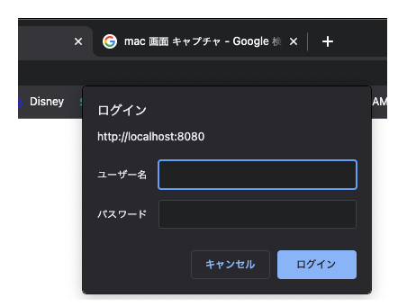

# Goを使ってBasic認証の実験

## 概要

Basic認証に成功していたら/privateの内容を表示し、
認証前であれば/loginにリダイレクトして認証を要求するような動作を実装してみた。


## 試し方

以下のコマンドでサーバーを起動する。

```bash
make run-server
```

"http://localhost:8080/private"にブラウザでアクセスすると/loginにリダイレクトして認証を求められる。

ユーザ：kuboshu; パスワード:kuboshuを入力すると認証が成功して、
/privateにリダイレクトして"This is private zone!!"のメッセージが表示される。

なお、一度認証に成功すると全てのブラウザを閉じるまで認証結果が保持されてしまい動作確認しづらいので、
chromeのシークレットウィンド上で実験するとやりやすいかも。
シークレットウィンドの場合は、そのウィンドのみを閉じれば認証結果もリセットされるっぽい。

## Basic認証の基本

Basic認証は、レスポンスのWWW-AuthenticateとリクエストのAuthorizationを使用した認証っぽい。

ページにアクセスした際にWWW-Authenticateを含んだレスポンスを受け取ると、
ブラウザを使用していた場合は認証の画面がポップアップする。
今回は認証指定な状態で/loginにアクセスすると下の画面が表示される。



ここにユーザー名とパスワードを入力すると、
以後のリクエストにAuthorizationヘッダーにパスワードとユーザー名が記述される。
要は、HTTPはステートレスなので、毎回パスワードの検証が必要になる。