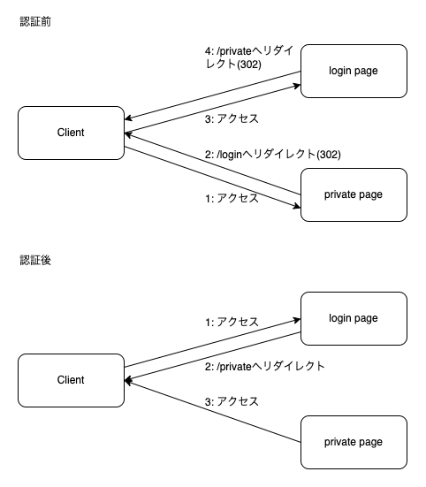

# Goを使ってBasic認証の実験

## 概要

Basic認証に成功していたら/privateの内容を表示し、
認証前であれば/loginにリダイレクトして認証を要求するような動作を実装してみた。

## Basic認証の基本

Basic認証は、レスポンスのWWW-AuthenticateとリクエストのAuthorizationを使用した認証っぽい。

ページにアクセスした際にWWW-Authenticateを含んだレスポンスを受け取ると、
ブラウザを使用していた場合は認証の画面がポップアップする。
今回は認証指定な状態で/loginにアクセスすると下の画面が表示される。

ここにユーザー名とパスワードを入力すると、
以後のリクエストにAuthorizationヘッダーにパスワードとユーザー名が記述される。
要は、HTTPはステートレスなので、毎回パスワードの検証が必要になる。